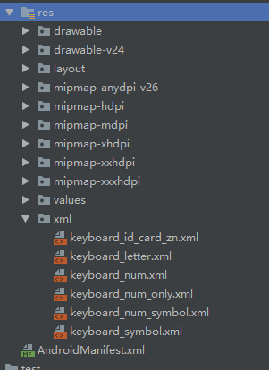
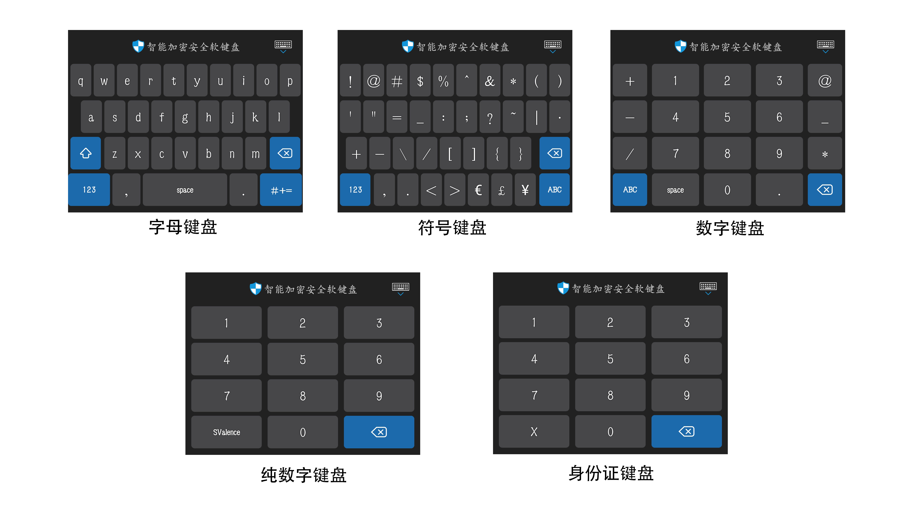

# **Android 自定义安全软键盘 SafeKeyboard 开发详细说明 2.0**

源码地址：GitHub:&nbsp;&nbsp;&nbsp;&nbsp;https://github.com/SValence/SafeKeyboard

## **一、Android 安全软键盘开发流程**

### 1. 建立软键盘样式

- 即在项目 `res 文件夹` 下 新建 `xml 文件夹`, 并在该文件夹中创建所需要的各种软键盘的样式(比如说:字母、数字、符号 等)

- 如下图所示:
</br></br>


### 2. 创建 `layout` 布局文件

- 在布局文件中给软键盘创建container，以便显示软键盘

### 3. 自定义 `KeyboardView`

- 自定义一个KeyboardView 并继承自KeyboardView，在自定义的KeyboardView中绘制特殊按键，包括按键的点击背景，图片，文字 等

### 4. 自定义一个普通 `java` 类，一般取名为 `**Keyboard.java`

- 把软键盘加载到container中，即在布局文件里预留的存放软键盘 的container

- 在类的内部实现软键盘的输入控制，键盘转换控制，软键盘的显示与隐藏控制 等

- 在需要用到软键盘的界面中实例化该 `Keyboard` 类，并传入必要的数据和信息

### 5. 效果图

- 如下图所示:
</br></br>

<!--  -->

## **二、 `Android` 安全软键盘开发实例解析（仅作参考）**

### 1. 创建项目后, 在 `layout` 布局文件中设计基本布局，参考如下

```xml
<!-- 详情请查看项目中 activity_main.xml 文件 -->

<?xml version="1.0" encoding="utf-8"?>
<RelativeLayout xmlns:android="http://schemas.android.com/apk/res/android"
    android:id="@+id/main_root"
    android:layout_width="match_parent"
    android:layout_height="match_parent">

    <LinearLayout
        android:layout_width="match_parent"
        android:layout_height="match_parent"
        android:orientation="vertical">

        <EditText
            android:id="@+id/normalEditText"
            android:layout_width="match_parent"
            android:layout_height="50sp"
            android:layout_marginStart="10sp"
            android:layout_marginEnd="10sp"
            android:hint="@string/keyboard_system"
            android:inputType="text" />

        <EditText
            android:id="@+id/safeEditText"
            android:layout_width="match_parent"
            android:layout_height="50sp"
            android:layout_marginStart="10sp"
            android:layout_marginEnd="10sp"
            android:hint="@string/keyboard_demo_new"
            android:inputType="textVisiblePassword" />

        <EditText
            android:id="@+id/safeEditText2"
            android:layout_width="match_parent"
            android:layout_height="50sp"
            android:layout_marginStart="10sp"
            android:layout_marginEnd="10sp"
            android:hint="@string/keyboard_demo_new2"
            android:inputType="number" />

        <EditText
            android:id="@+id/safeEditText3"
            android:layout_width="match_parent"
            android:layout_height="50sp"
            android:layout_marginStart="10sp"
            android:layout_marginEnd="10sp"
            android:hint="@string/keyboard_demo_new3" />

    </LinearLayout>

    <LinearLayout
        android:id="@+id/keyboardViewPlace"
        android:layout_width="match_parent"
        android:layout_height="wrap_content"
        android:layout_alignParentBottom="true"
        android:orientation="vertical" />

</RelativeLayout>
```

- 这里使用一个线性布局作为存放自定义软键盘的容器，说明一下:

- 一般使用到自定义软键盘的页面的布局不会很复杂，无非就是想要在输入关键数据比如密码时才使用到软键盘，而软键盘一般都是在手机等移动设备屏幕的最下方显示，以方便输入，所以这里使用了 `RelativeLayout` 方便显示，当然也可以使用现在 `google` 推行的 `ConstraintLayout` 布局来做，这个根据个人喜好。

- 所以在原有的项目里加入一个存放软键盘的容器，也不会给原有的项目带来很大的麻烦或者影响，所以这种做法，我个人认为还是可取的.

### 2. 在项目 `res` 文件夹下创建 `xml` 文件夹，并创建出自己需要的软键盘布局，比如说：数字，字母，符号等

- 字母键盘布局示例:

```xml
<!-- 详情及其他键盘布局请查看项目中 /res/xml 文件夹 -->

<?xml version="1.0" encoding="utf-8"?>
<Keyboard xmlns:android="http://schemas.android.com/apk/res/android"
    android:horizontalGap="1%p"
    android:keyHeight="@dimen/key_height"
    android:keyWidth="10%p"
    android:verticalGap="@dimen/key_vertical_gap">
    <Row>
        <Key android:codes="113" android:keyEdgeFlags="left" android:keyLabel="q" android:keyWidth="8.9%p" />
        <Key android:codes="119" android:keyLabel="w" android:keyWidth="8.9%p" />
        <Key android:codes="101" android:keyLabel="e" android:keyWidth="8.9%p" />
        <Key android:codes="114" android:keyLabel="r" android:keyWidth="8.9%p" />
        <Key android:codes="116" android:keyLabel="t" android:keyWidth="8.9%p" />
        <Key android:codes="121" android:keyLabel="y" android:keyWidth="8.9%p" />
        <Key android:codes="117" android:keyLabel="u" android:keyWidth="8.9%p" />
        <Key android:codes="105" android:keyLabel="i" android:keyWidth="8.9%p" />
        <Key android:codes="111" android:keyLabel="o" android:keyWidth="8.9%p" />
        <Key android:codes="112" android:keyEdgeFlags="right" android:keyLabel="p" android:keyWidth="8.9%p" />
    </Row>
    <Row>
        <Key android:codes="97" android:horizontalGap="5.5%p" android:keyEdgeFlags="left" android:keyLabel="a" android:keyWidth="9%p" />
        <Key android:codes="115" android:keyLabel="s" android:keyWidth="9%p" />
        <Key android:codes="100" android:keyLabel="d" android:keyWidth="9%p" />
        <Key android:codes="102" android:keyLabel="f" android:keyWidth="9%p" />
        <Key android:codes="103" android:keyLabel="g" android:keyWidth="9%p" />
        <Key android:codes="104" android:keyLabel="h" android:keyWidth="9%p" />
        <Key android:codes="106" android:keyLabel="j" android:keyWidth="9%p" />
        <Key android:codes="107" android:keyLabel="k" android:keyWidth="9%p" />
        <Key android:codes="108" android:keyEdgeFlags="right" android:keyLabel="l" android:keyWidth="9%p" />
    </Row>
    <Row>
        <Key android:codes="-1" android:isModifier="true" android:isSticky="true" android:keyEdgeFlags="left" android:keyWidth="13%p" />
        <Key android:codes="122" android:horizontalGap="1.5%p" android:keyLabel="z" android:keyWidth="9%p" />
        <Key android:codes="120" android:keyLabel="x" android:keyWidth="9%p" />
        <Key android:codes="99" android:keyLabel="c" android:keyWidth="9%p" />
        <Key android:codes="118" android:keyLabel="v" android:keyWidth="9%p" />
        <Key android:codes="98" android:keyLabel="b" android:keyWidth="9%p" />
        <Key android:codes="110" android:keyLabel="n" android:keyWidth="9%p" />
        <Key android:codes="109" android:keyLabel="m" android:keyWidth="9%p" />
        <Key android:codes="-5" android:horizontalGap="1.5%p" android:isRepeatable="true" android:keyWidth="13%p" />
    </Row>
    <Row android:rowEdgeFlags="bottom">
        <Key android:codes="-2" android:keyLabel="123" android:keyWidth="19%p" />
        <Key android:codes="32" android:isRepeatable="false" android:keyLabel="space" android:keyWidth="58%p" />
        <Key android:codes="100860" android:keyEdgeFlags="right" android:keyLabel="#+=" android:keyWidth="19%p" />
    </Row>
</Keyboard>
```
- 简单说明一下, 每个按键代表的字符的 `keycode` 一般来说都是固定的， `android` 系统会预先存储一些 `keycode` 并占有这些数据

- 我们在使用的时候直接拿来使用就可以，如果想自己来控制的话，就需要避过这些已经被系统占用的 `code`

- 比如说在符号键盘的最后一个 `code` 为 `100860` 的按键，我在测试时曾经用过 `10086` 作为 `code` ，但是发现它的作用是输出一个图形字符，而不是切换到字母键盘的作用，说明 `10086` 这个 `code` 已经被系统占用，那 `code 10086 `就不能继续使用, 这是开发者在使用的时候要注意的一个问题

- 我甚至觉得, 如果只填写 `android:codes` 属性, 不填写 `android:keyLabel`, 如果系统已经占用的话, 会有个默认的文本输出 (纯猜测, 以后验证)

- 以下为 `Demo` 中已有的多种键盘效果图:
</br></br>


### 3. 整个自定义软键盘布局文件(包括按键布局和点击输入完成隐藏输入法的布局) `layout_keyboard_containor.xml`

```xml
<?xml version="1.0" encoding="utf-8"?>
<LinearLayout xmlns:android="http://schemas.android.com/apk/res/android"
    xmlns:app="http://schemas.android.com/apk/res-auto"
    xmlns:tools="http://schemas.android.com/tools"
    android:layout_width="match_parent"
    android:layout_height="wrap_content"
    android:background="@color/keyboardBackColor"
    android:orientation="vertical">

    <RelativeLayout
        android:id="@+id/keyboardHeader"
        android:layout_width="match_parent"
        android:layout_height="@dimen/keyboard_tip_height"
        android:background="@color/keyboardBackColor">

        <LinearLayout
            android:layout_width="wrap_content"
            android:layout_height="match_parent"
            android:layout_centerInParent="true"
            android:orientation="horizontal"
            tools:ignore="RelativeOverlap,UseCompoundDrawables">

            <ImageView
                android:layout_width="25sp"
                android:layout_height="25sp"
                android:layout_gravity="center_vertical"
                android:contentDescription="@string/description"
                android:src="@drawable/shield" />

            <TextView
                android:id="@+id/keyboardTip"
                android:layout_width="wrap_content"
                android:layout_height="wrap_content"
                android:layout_gravity="center_vertical"
                android:text="@string/safe_keyboard"
                android:textColor="@color/lightGray"
                android:textSize="16sp" />
        </LinearLayout>

        <FrameLayout
            android:id="@+id/keyboardDone"
            android:layout_width="60sp"
            android:layout_height="match_parent"
            android:layout_alignParentEnd="true"
            android:layout_centerVertical="true"
            android:background="@drawable/bg_keyboard_done">

            <ImageView
                android:layout_width="30sp"
                android:layout_height="30sp"
                android:layout_gravity="center"
                android:contentDescription="@null"
                android:scaleType="centerInside"
                android:src="@drawable/keyboard_done_"
                android:textColor="@color/white"
                android:textSize="16sp" />
        </FrameLayout>

    </RelativeLayout>

    <FrameLayout
        android:id="@+id/keyboardLayer"
        android:layout_width="match_parent"
        android:layout_height="wrap_content"
        android:layout_marginTop="2sp"
        android:layout_marginBottom="10sp">

        <com.safe.keyboard.SafeKeyboardView
            android:id="@+id/safeKeyboardLetter"
            android:layout_width="match_parent"
            android:layout_height="wrap_content"
            android:animateLayoutChanges="true"
            android:background="@color/keyboardBackColor"
            android:focusable="true"
            android:focusableInTouchMode="true"
            android:keyBackground="@drawable/keyboard_press_bg"
            android:keyPreviewHeight="60dp"
            android:keyPreviewLayout="@layout/keyboard_preview_layout"
            android:keyPreviewOffset="0dp"
            android:keyTextColor="@color/white"
            app:random_digit="false"
            app:remember_last_type="true" />

    </FrameLayout>
</LinearLayout>
```

#### 3.1 `com.safe.keyboard.SafeKeyboardView` 中的属性值得关注的有:

- `background="@color/keyboardBackColor"` </br>
    `background` 设置了每个按键的点击背景变化， 这个是统一的设置的, <Key> 标签不支持单独设置背景, 当然有办法可以实现单独设置背景, 后面会继续介绍

- `keyPreviewLayout="@layout/keyboard_preview_layout"`</br>
   设置了 `keyPreviewLayout` 属性后, 你点击按键时会显示出来当前点击a，以便提示用户是否点错，其内容也是一个布局文件，但是比较简单，一般来说就是一个设置了背景，字体大小和颜色的 `TextView` (下面会贴出样例的布局文件代码)

- 与 `keyPreview` 相关的几个属性</br>
   需要注意的是 `keyPreviewOffset`  这个属性，它决定了这个提示布局的显示位置，值越大显示位置越靠下，有兴趣的可以试一试这个属性，下面是 `keyboard_preview_layout.xml` 字符提示预览布局文件

   ```xml
   <?xml version="1.0" encoding="utf-8"?>
   <TextView xmlns:android="http://schemas.android.com/apk/res/android"
        android:layout_width="wrap_content"
        android:layout_height="match_parent"
        android:layout_gravity="center"
        android:background="@drawable/keyboard_preview_bg"
        android:gravity="center_horizontal"
        android:textColor="@color/keyboardNormal"
        android:textSize="35sp"
        android:textStyle="bold" />
   ```

## **三、 `Android` 安全软键盘功能的 `Java` 逻辑 代码实现**

- 划重点了

### 1. `SafeKeyboardView.java` 实现 (源码请查看 `SafeKeyboardView.java` 文件)

继承于 `KeyboardView` ，在这个自定义View中绘制一些特殊的按键，比如说 删除、大小写转换、切换键盘类型等等的按键，从而实现这些特殊按键的点击效果的转变。

- 删除、键盘切换、大小写切换 等按键需要区别于普通按键, 就不能使用统一设置的 `background="@color/keyboardBackColor"`， 那么就需要重新绘制新的背景，同时由于重新绘制背景会覆盖原先设置的 `keyLabel` 值, 所以同时需要重新绘制按键本, 即: 文件中的两个方法

    ```java
    /**
     * @param id         背景资源 id
     * @param canvas     Canvas
     * @param key        需要绘制的按键
     */
    drawKeyBackground(int id, Canvas canvas, Keyboard.Key key);

    /**
     * 该方法在绘制特殊按键图标时实现了: 保留图标原有的宽高比例, 保证图标不会被异常拉伸
     * 约定: 最终图标的宽度和高度都需要在按键的宽度和高度的二分之一以内
     * 如果: 图标的实际宽度和高度都在按键的宽度和高度的二分之一以内, 那就不需要变换, 否则就需要等比例缩小
     * 开发者可根据实际情况及个人喜好修改 此 `二分之一` 的约定
     * 
     * @param canvas     Canvas
     * @param key        需要绘制的按键
     * @param drawable   按键的图标
     * @param color      文字颜色
     */
    drawTextAndIcon(Canvas canvas, Keyboard.Key key, @Nullable Drawable drawable, int color)
    ```

### 2. `SafeKeyboard.java` 实现 （源码请查看 `SafeKeyboard.java` 文件）

`SafeKeyboard` 类是实现键盘输入等功能的核心，软键盘的输入、删除、显示、隐藏等等都需要在这里完成，其中最重要的有五个部分

- 1. `SafeKeyboardView` 要设置 `OnKeyboardActionListener` 监听</br></br>

- 2. 隐藏系统默认输入法软键盘</br></br>

- 3. 支持多 `EditText` 共用一个 `SafeKeyboard`</br></br>

- 4. `SafeKeyboard` 的显示和隐藏动画

- 5. 记住每个 `EditText` 上此所显示的键盘类型

#### 2.1 设置 `OnKeyboardActionListener` 监听详细介绍

这个地方我主要重写了 `onKey(...)`, `onPress(...)` 两个方法

- 在 `onPress(...)` 中控制该类型的键盘开启按下按钮预览功能 `setPreviewEnabled(boolean)`

- 在  `onKey(...)` 中控制 `键盘切换` 、 `键盘隐藏` 、 `英文大小写切换` 、 `字符输入` 等功能

- <font color=red size=5>注意</font></br>
正常的输入字符的时候，不能单纯的使用：</br>
`editable.insert(start, Character.toString((char) primaryCode));`</br>
<font color=red size=4>要使用: </font></br>
`editable.replace(start, end, Character.toString((char) primaryCode));`</br></br>
因为这是默认不选中 `EditText` 中文本情况，一旦选中文本就会造成最后的结果和期望的输入结果出现偏差，选中的文本没有被替换，只是纯粹的增加刚刚输入的字符，所以要获取 `EditText` 中光标的开始和结束位置，并把输入的字符替换掉选中的文本部分. ( 这就是在效果图中有选中文本输入的原因 )

#### 2.2 隐藏系统默认输入法软键盘

当我们需要显示自定义软键盘时， `EditText` 获取焦点后会弹出系统默认输入法键盘，这时，我们就需要强制隐藏默认键盘。需调用 </br>`private void hideSystemKeyBoard(EditText edit)` </br>方法，(感谢网络上各位开发者的分享)

#### 2.3 支持多 `EditText` 共用一个 `SafeKeyboard`

为实现此功能, 需要满足以下两点: 

- 1. 在 `SafeKeyboard` 中增加一个 `HashMap<Integer, EditText>`, 用于保存每个 需要使用 `SafeKeyboard` 的 `EditText` </br></br>

- 2. 将显示 `SafeKeyboard` 的布局文件根布局 id 传入并保存.  </br>
目的为: 设置全局焦点变化监听, 当焦点在页面中来回切换时决定对 `SafeKeyboard` 进行适当的操作</br>
详见 变量 `onGlobalFocusChangeListener` 实现

#### 2.4 `SafeKeyboard` 的显示和隐藏动画

如果我们对于输入法的显示和隐藏没有过多的要求，那么可以直接设置软键盘容器的 `Visibility` 为 `GONE` 或者 `VISIBLE`，但是对于我这种有点强迫症的程序猿来说，能够把自己的项目的效果做的比较合情合理并给用户良好的体验，一直是我个人追求的事情。所以在上面的例子中增加了显示和隐藏动画，显示为从屏幕最下方滑动到固定位置，隐藏为从固定位置滑动到屏幕最下方，于是就多了 `Animation` 的使用。

- 1. 当目标 `EditText` 被点击或者获得焦点的时候，如果 `SafeKeyboard`</br>
        &nbsp;&nbsp;&nbsp;&nbsp;1 )  `SafeKeyboard` 没有显示, 并且不处于正在显示过程&nbsp;&nbsp;&nbsp;&nbsp;<font color=red size=4>或者: </font></br>
        &nbsp;&nbsp;&nbsp;&nbsp;2 )  `SafeKeyboard` 正在隐藏</br>
    那么强制隐藏系统默认键盘，显示 `SafeKeyboard`</br>
    否则, 说明 `SafeKeyboard` 处于显示状态， 这里根据对应的 `EditText` 输入类型切换不同的键盘即可

        ```java
        /** 
        * 即调用此方法
        * @param    mEditText      目标输入框
        */
        private void keyboardPreShow(EditText mEditText)
        ```

- 2. 当目标 `EditText` 失去焦点的时候，如果 `SafeKeyboard`</br>
        &nbsp;&nbsp;&nbsp;&nbsp;1 )  `SafeKeyboard` 已经显示，并不处于正在隐藏过程&nbsp;&nbsp;&nbsp;&nbsp;<font color=red size=4>或者: </font></br>
        &nbsp;&nbsp;&nbsp;&nbsp;2 )  `SafeKeyboard` 正在显示</br>
    那么强制隐藏系统默认键盘，显示 `SafeKeyboard`</br>
    否则, 说明 `SafeKeyboard` 处于显示状态， 这里根据对应的 `EditText` 输入类型切换不同的键盘即可

        ```java
        /** 
        * 即调用此方法
        */
        private void keyboardPreHide()
        ```

#### 2.5 记住每个 `EditText` 上此所显示的键盘类型

记住每个 `EditText` 上此所显示的键盘类型, 并在其重新获得焦点显示 `SafeKeyboard` 时, 显示上次键盘

此功能可在布局文件中
```xml
app:remember_last_type="true"
```
或者直接调用
```java
public void enableRememberLastKeyboardType(boolean enable)
```
进行指定

</br>
以上逻辑在代码中均有体现，实例项目源代码链接也会在文章结尾处贴出

感谢各位开发者的分享，参考项目：

1.&nbsp;&nbsp;&nbsp;&nbsp;https://www.cnblogs.com/liuyu0529/p/7793610.html , 因为本人不善于UI设计，所以键盘布局基本和这个项目区别不大，根据个人喜好作了一些必要的调整

2.&nbsp;&nbsp;&nbsp;&nbsp;https://github.com/StomHong/CustomizeKeyboard

因为一些项目需要，我在网上查了一些资料，参考已有项目，对开发 `Android` 自定义软键盘重新梳理和编程工作，并且增加和优化一些功能，有需要的开发者可以根据自己的项目需要进行参考或者修改。

源码地址：GitHub:&nbsp;&nbsp;&nbsp;&nbsp;https://github.com/SValence/SafeKeyboard


